  

  <em>AI/ML Engineer · Researcher · Builder</em>

  
  

 

- Building AI that is **efficient, accessible, and useful in the real world**
- Focus: **NLP for low-resource & African languages** (Tigrinya / Ge'ez), Computer Vision, and applied LLM systems
- Lifecycle: `Research → Data → Models → Engineering → Deployment`

`LLMs & Agents` `RAG` `Tigrinya / Ge'ez NLP` `Computer Vision` `On-device AI` `Responsible AI`

 

&nbsp;&nbsp;

**LLMs · RAG · Transformers · GGUF / llama.cpp · MongoDB · RDF / SPARQL · AWS · Linux · CI/CD**

 

| Project | Focus |
|---|---|
| 🧠 **AIPal** | Offline, on-device AI assistant with local LLM inference |
| 🌍 **Tigrinya NLP** | Tokenization, language modeling & NLP tooling |
| 🗣️ **Ge'ez NER** | Named Entity Recognition for low-resource language data |
| ⌨️ **Predictive Keyboard** | Language modeling for Tigrinya input |
| 🏃 **Jump Analysis** | Computer vision & pose estimation for jump-height measurement |
| 🌱 **Plant Disease Detection** | CNN-based agricultural computer vision |
| 🛡️ **AI Security Research** | Deep learning approaches for intrusion detection |

 

Low-Resource NLP → African Language AI → Efficient LLMs → Edge AI → Responsible AI

MSc Artificial Intelligence · ML Research & Engineering · Teaching (OOP, Data Structures, Python)

 

  
  

  
  

